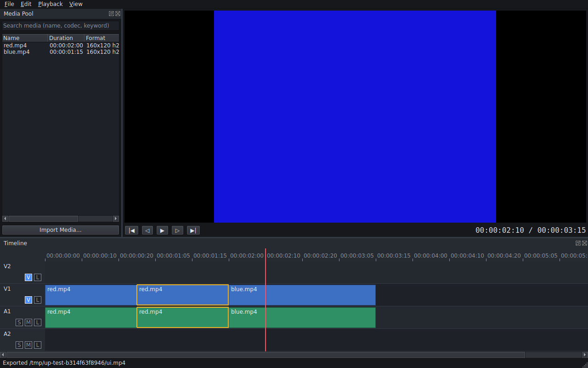

# Ultimate Post

Ultimate Post is an original, native, cross-platform post-production application. The long-term goal is one project covering editing, compositing, colour, audio, AI-assisted workflows and delivery.

It is at an **early stage**. The foundation and the first end-to-end vertical slice work:
**create project → import → show media → drag to timeline → play → cut → trim → add clips and audio → save → reopen → export**.
Everything else is on the [roadmap](docs/roadmap.md). The [feature status](docs/feature-status.md) page says exactly what does and doesn't work.



## Highlights
- C++20 engine with strict module boundaries; the UI and CLI share one service layer (`EditorSession`)
- Frame-accurate timeline: overwrite/insert/append, razor, lift, ripple delete, trim, ripple trim, roll, slip, slide, move, linked A/V, sync-locked insert
- Command-based undo/redo with exact timeline snapshots
- Versioned, human-readable `.uproj` projects with migrations, atomic saves, backups, autosave and crash recovery
- Real-time playback with audio as the master clock and video rendered ahead on a worker thread
- FFmpeg-based probing, frame-accurate decoding, resampled audio, H.264/AAC export in the background with cancel
- Offline media detection, relinking, and folder-relative media resolution
- Thumbnails and audio waveforms generated by a background job queue into a safely deletable disk cache
- Qt 6 desktop UI with dark, light and high-contrast themes built from central design tokens
- 95 automated tests (unit, integration, end-to-end export verification, offscreen UI)

## Build
```bash
cmake -S . -B build -G Ninja && cmake --build build && ctest --test-dir build
```
See [docs/build.md](docs/build.md) for dependencies on Linux, macOS and Windows.

## Run
```bash
build/src/ui/ultimatepost-studio            # desktop app
build/src/cli/ultimatepost help             # CLI
```

### CLI walkthrough
```bash
UP=build/src/cli/ultimatepost
$UP gen-test-media a.mp4 --pattern bars --frames 100
$UP gen-test-media b.mp4 --pattern solid --color 20,20,220 --frames 50
$UP new demo.uproj --size 1280x720 --fps 25
$UP import demo.uproj a.mp4 b.mp4
$UP append demo.uproj a.mp4
$UP razor demo.uproj 00:00:02:00
$UP trim demo.uproj V1:2 out -10
$UP append demo.uproj b.mp4
$UP info demo.uproj
$UP export demo.uproj demo.mp4
$UP analyze demo.uproj          # thumbnails + waveforms into the cache
```

## Documentation
- [Architecture assessment](docs/architecture-assessment.md): the initial repository assessment and technology decisions
- [Architecture](docs/architecture.md)
- [Project format](docs/project-format.md)
- [Timeline engine](docs/timeline.md)
- [Rendering, codecs and audio](docs/rendering.md)
- [Testing](docs/testing.md)
- [Feature status](docs/feature-status.md)
- [Roadmap](docs/roadmap.md)

## Repository layout
```
src/core      errors, logging, time, commands, atomic IO
src/cache     regeneratable disk cache
src/jobs      background job queue
src/timeline  timeline model + edit operations
src/project   project model + .uproj format
src/codec     FFmpeg probe/decode/encode
src/media     import, relink, search, synthetic media
src/render    compositor, mixer, export
src/playback  real-time A/V playback engine
src/app       EditorSession (application services)
src/cli       ultimatepost CLI
src/ui        Qt desktop application
tests/        unit, integration, ui
docs/         documentation
```

`index.html` is an unrelated page that predates this project.
